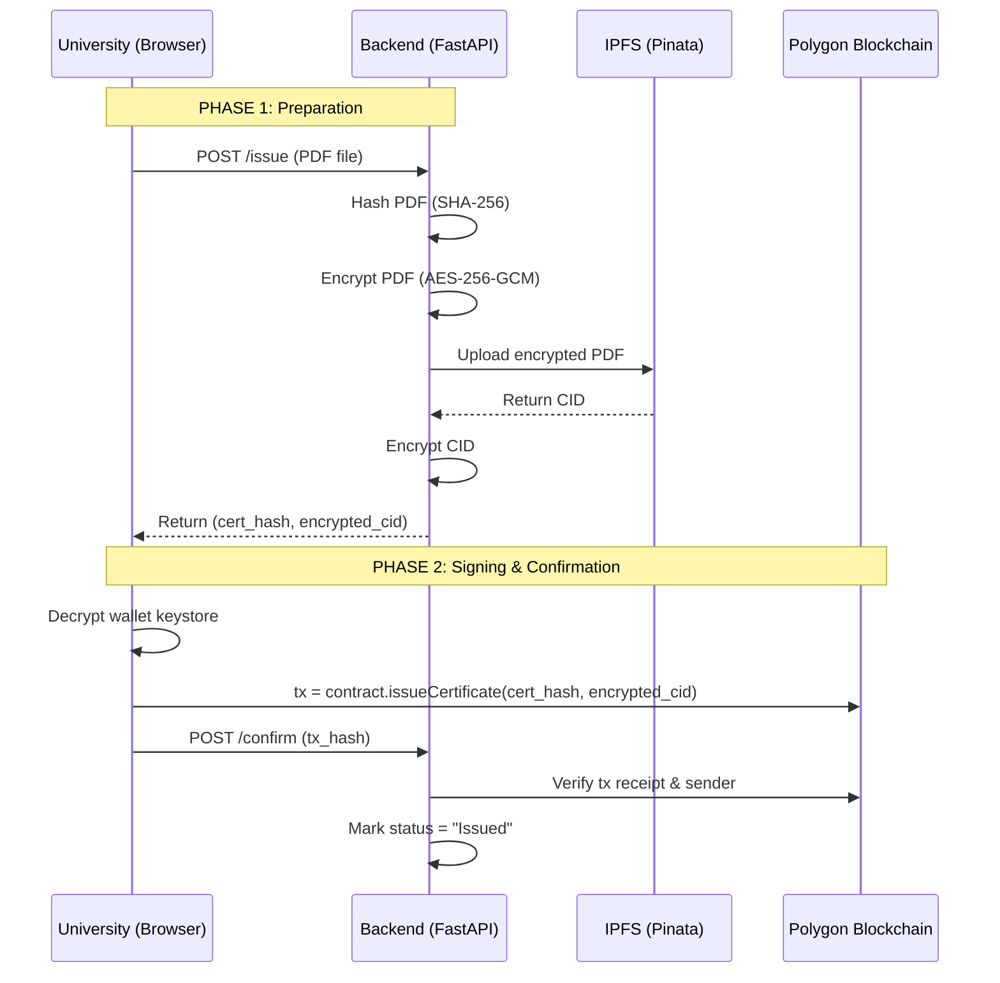
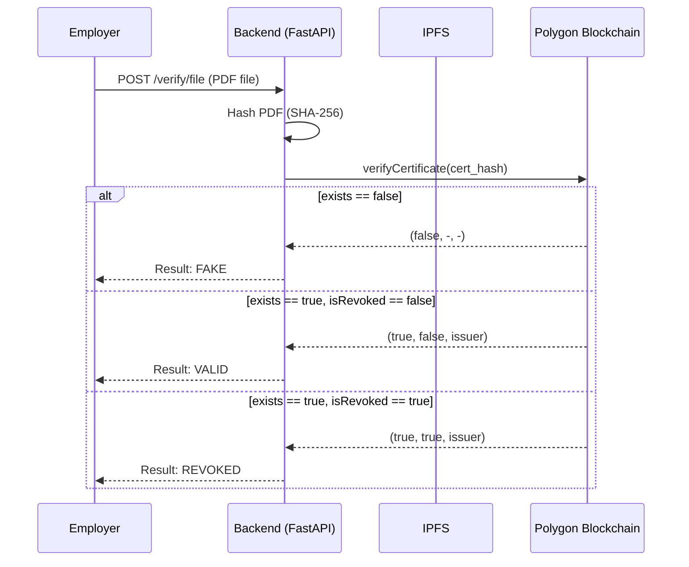

# TrustChain Architecture & Flows

This document details the core architectural decisions and data flows that make TrustChain secure and verifiable.

## 1. System Overview

TrustChain operates across three primary layers:
1. **Frontend (React):** Handles all cryptographic signing and wallet management client-side.
2. **Backend (FastAPI):** Manages file encryption, hashing, IPFS uploads, and transaction verification.
3. **Blockchain (Polygon Amoy):** The immutable ledger that stores certificate hashes and revocation statuses.

---

## 2. Certificate Issuance (Two-Phase Flow)

Issuing a certificate requires a secure handshake between the backend (which handles IPFS) and the frontend (which holds the private key).

---

## 3. Public Verification Flow

When an employer wants to verify a certificate, they don't need a wallet or crypto knowledge. They simply upload the PDF or scan the QR code.

---

## 4. Wallet Management & Security

We designed a zero-trust architecture for University private keys:

1. **Generation:** When a university registers, `ethers.Wallet.createRandom()` generates a fresh wallet entirely in the browser.
2. **Encryption:** The private key is encrypted with the user's password using the `scrypt` key derivation function and AES-128-CTR encryption, producing a standard Ethereum Keystore V3 JSON file.
3. **Storage:** The Keystore JSON is saved in the browser's `localStorage`. The backend *only* receives the public address to whitelist it on the smart contract.
4. **Usage:** On subsequent logins, the user inputs their password, the frontend decrypts the keystore into memory, and signs transactions directly to Polygon via a public RPC node. **The private key never leaves the browser.**
